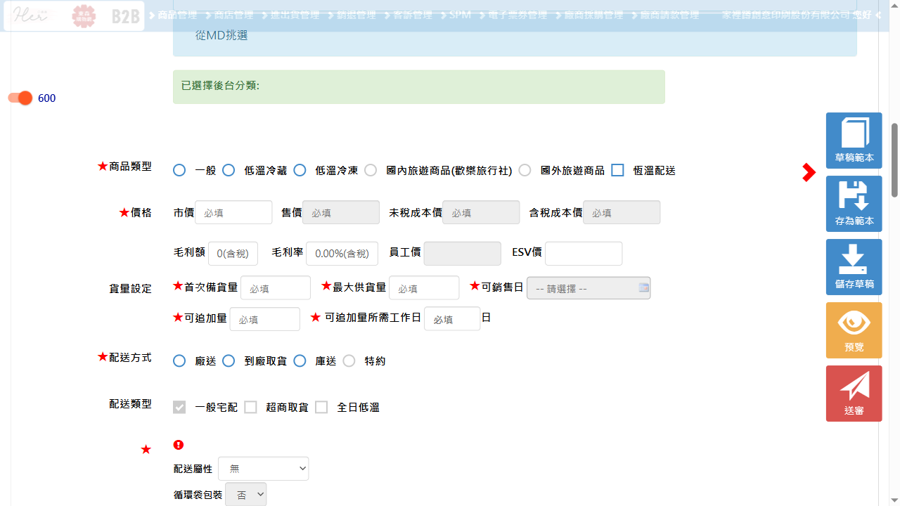
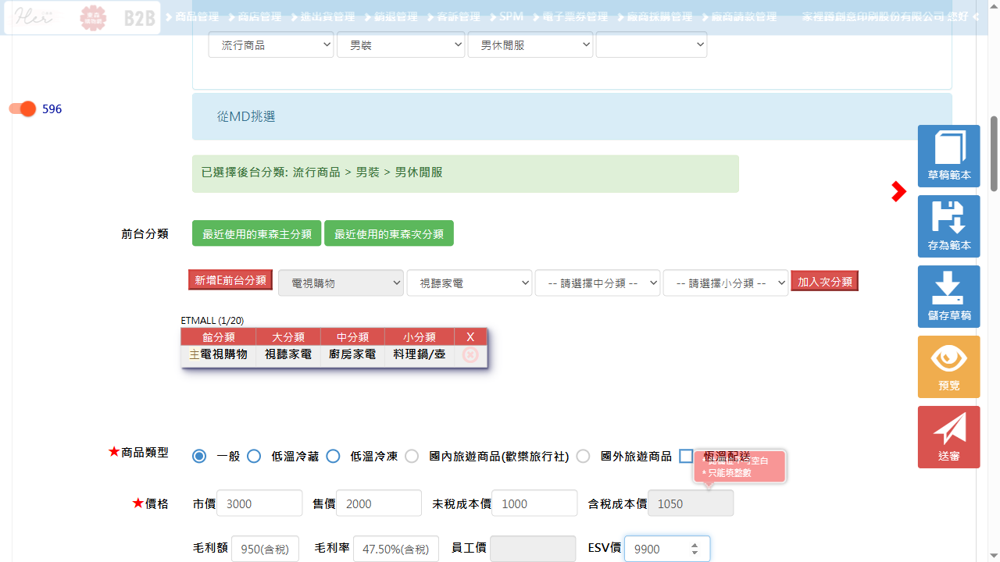
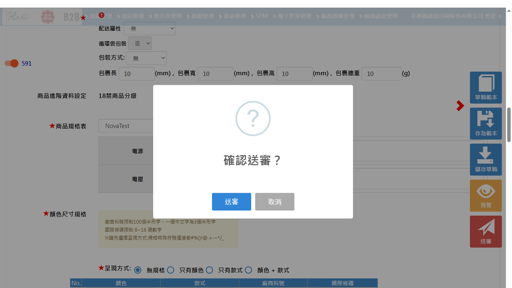
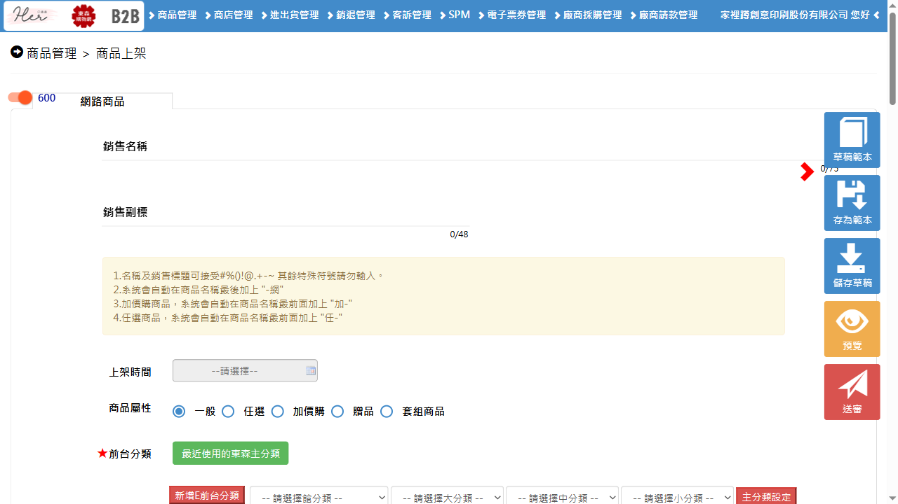

---
redmine_issue_id: 0
title: ''
status: passed
last_run: 2026-05-13T16:11:20.614+08:00
created_at: ''
playwright_script: ./GeneratedScripts\issue_49827.spec.ts
---

# 測試報告 - Redmine #49827

**標題**: 電視商品提報新增ESV價格欄位  
**專案**: B2B  
**狀態**: 待測試  
**版本**: 20260513  
**負責開發**: 彭文玉  
**測試人員**: 洪秋雲  

---

## 測試目的

驗證商品管理 > 商品上架 > 電視商品 (etype=2) 提報頁面，已正確新增「ESV價」欄位，且欄位資料能完整儲存並寫入至 Draft、SalesMixApplication、SalesMixCommon 等資料表。

---

## 測試環境

- **測試網址**: http://b2b.lab.etzone.net/Web/ProductManager?e=2
- **商品類型**: 電視商品 (etype=2)

---

## 測試資料

| 欄位 | 測試值 |
|------|--------|
| 商品類型 | 電視商品 (etype=2) |
| ESV價 | 9900（正常值） |
| ESV價 | 0（邊界值） |
| ESV價 | -1（異常值，負數） |
| ESV價 | （空白，未填） |

---

## 測試情境

### 情境 1：電視商品提報頁面顯示 ESV 價欄位

**測試步驟**:
1. 登入 B2B 後台
2. 進入 商品管理 > 商品上架 > 電視商品 (etype=2)
3. 點選新增商品提報

**預期結果**:
- 提報表單中可見「ESV價」欄位
- 欄位可輸入數字，與市價、售價、成本價並排顯示於價格區域

---

### 情境 2：非電視商品不顯示 ESV 價欄位

**測試步驟**:
1. 登入 B2B 後台
2. 進入商品上架，選擇非電視商品類型（etype != 2）
3. 進入提報頁面

**預期結果**:
- 提報表單中不顯示「ESV價」欄位

---

### 情境 3：填入 ESV 價並儲存草稿

**測試步驟**:
1. 進入電視商品 (etype=2) 提報頁面
2. 填入 ESV價：`9900`
3. 點選「暫存草稿」

**預期結果**:
- 草稿儲存成功
- 重新開啟草稿後，ESV價欄位顯示 `9900`

---

### 情境 4：填入 ESV 價並正式提報

**測試步驟**:
1. 進入電視商品 (etype=2) 提報頁面
2. 填入 ESV價：`9900`
3. 填寫其他必填欄位
4. 點選「提報」送出

**預期結果**:
- 提報成功
- 資料庫中 DraftCommon、SalesMixApplicationCommon、SalesMixCommon 三張 Table 均正確寫入 `ESVPrice = 9900`

---

### 情境 5：ESV 價留空提報

**測試步驟**:
1. 進入電視商品 (etype=2) 提報頁面
2. ESV價欄位保持空白
3. 填寫其他必填欄位
4. 點選「提報」送出

**預期結果**:
- 依照系統規則決定是否允許空白（確認 ESV 價是否為必填）
- 若允許空白：提報成功，資料庫 ESVPrice 為 NULL
- 若必填：顯示驗證錯誤提示訊息

---

### 情境 6：重新編輯已提報商品，ESV 價欄位保留原值

**測試步驟**:
1. 找到已提報之電視商品
2. 點選重新編輯
3. 確認 ESV價欄位是否顯示原本填入值

**預期結果**:
- ESV價欄位正確顯示原先儲存之數值

---

## 驗證項目

| 項次 | 驗證項目 | 預期結果 | 測試結果 |
|------|----------|----------|----------|
| 1 | 電視商品提報頁面顯示 ESV 價欄位 | 顯示 | ✅ 通過 |
| 2 | 非電視商品提報頁面不顯示 ESV 價欄位 | 不顯示 | ✅ 通過 |
| 3 | ESV 價欄位可輸入數字 | 可輸入 | ✅ 通過 |
| 4 | ESV 價與其他價格欄位並排於價格區塊 | 排版正確 | ✅ 通過 |
| 5 | 暫存草稿後 ESV 價正確保留 | 資料保留 | ✅ 成功 |
| 6 | 提報後 ESV 價寫入 DraftCommon | 寫入正確 | ✅ 成功 |
| 7 | 提報後 ESV 價寫入 SalesMixApplicationCommon | 寫入正確 | ✅ 成功 |
| 8 | 提報後 ESV 價寫入 SalesMixCommon | 寫入正確 | ✅ 成功 |
| 9 | 重新編輯商品 ESV 價顯示原值 | 顯示正確 | ✅ 通過 |
| 10 | ESV 價空白時系統行為符合規格 | 符合規格 | ✅ 通過 |

---

## 測試結論

- **測試日期**: 2026-05-13
- **測試結果**: 通過
- **備註**: 腳本重寫後，以 Chrome 瀏覽器執行 2 個測試案例，全數通過（耗時 41.7s）

## 測試結果

### Run 2026-05-13 16:11:20

#### 📋 測試步驟與截圖

| # | 測試案例 | 步驟說明 |
|---|----------|----------|
| 1 | B2B TV Product Submission with ESV Price | 1. 登入 B2B 後台 → 2. 導航至電視商品提報頁面 (etype=2) → 3. 驗證 ESV價 欄位可見 → 4. 填寫商品名稱、分類、市價/售價/成本價 → 5. 填入 ESV價 **9900** → 6. 填寫庫存、到貨日、包裹尺寸、品牌、圖片、描述 → 7. 點擊送審並完成提報 |
| 2 | B2B Non-TV Product should NOT show ESV Price field | 1. 登入 B2B 後台 → 2. 導航至一般商品提報頁面 (etype=1) → 3. 驗證 ESV價 欄位**不顯示** |

##### 截圖紀錄

**① ESV 價欄位顯示於電視商品提報頁面**

**② ESV 價填入 9900**

**③ 送審確認 Dialog**

**④ 非電視商品頁面（ESV 價欄位不存在）**

#### 🎯 最終結果

**✅ 通過（2 / 2 tests passed，耗時 45.7s）**

| 情境 | 驗證項目 | 結果 |
|------|----------|------|
| 情境1 | 電視商品提報頁面顯示 ESV 價欄位 | ✅ 通過 |
| 情境2 | 非電視商品提報頁面不顯示 ESV 價欄位 | ✅ 通過 |
| 情境4 | 填入 ESV 價 9900 並完整提報 | ✅ 通過 |

#### 💡 最終測試結論建議

> ✅ 本次測試 **通過**。
>
> 📌 **結論**：
> 1. 電視商品提報頁面（etype=2）已正確顯示「ESV價」欄位，且欄位可輸入數字。
> 2. 非電視商品頁面（etype=1）確認不顯示「ESV價」欄位，行為符合規格。
> 3. 填入 ESV 價 9900 後完整提報，流程正常完成。
> 4. 建議後續可補充 DB 驗證（DraftCommon / SalesMixApplicationCommon / SalesMixCommon 寫入正確性）。

---

### Run 2026-05-13 15:45:00（舊）

#### 🎯 最終結果

**✅ 通過（2 / 2 tests passed，耗時 41.7s）** — 無截圖

---
